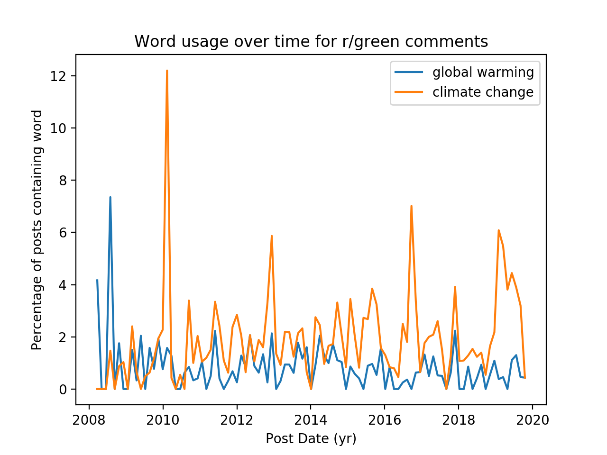

# Analyzing Climate Change Discourse and Communities on Reddit

## Introduction

The role of humans in climate change was predicted over 100 years ago by Svante Arrhenius [[ref]](https://www.rsc.org/images/Arrhenius1896_tcm18-173546.pdf), and since then a formidable body of scientific evidence has accumulated leading over 97% of scientists to conclude that human activity has a significant impact on the climate [[ref]](https://skepticalscience.com/global-warming-scientific-consensus-intermediate.htm). An ever-improving collection of climate models even allow us to estimate the exact degree to which we will cause the planet to warm, and the details of how this will impact specific ecosystems and industries. Increasingly, these predictions are being validated by an increase in extreme weather events, collapsing ecosystems, and warming temperatures around the globe.

Despite the overwhelming evidence of anthropogenic global warming (AGW), in general we have been incredibly slow to take significant action to mitigate our impact on the climate. There are **many** factors contributing to this hesitation — one of which is widespread skepticism or denial of the reality of AGW. For certain individuals and companies (most notably fossil-fuel industries), avoiding climate action is a profitable strategy in the short term. As a result, they have mounted numerous campains to spread misinformation and discredit climate science [[ref]](https://www.merchantsofdoubt.org/).

 Moving the needle on climate action will likely require us to convince climate skeptics of the reality

In this project, we set out to explore climate skepticism as it manifests on Reddit.

## Pushshift API

## Experiments

### Topic Modelling

### Clustering

### Word usage trends

### Linking

### Sentiment Analysis

## Discussion

## Related Work

